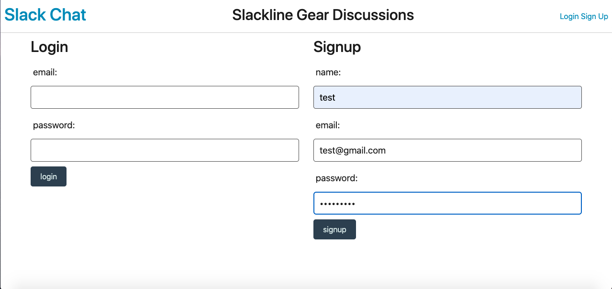
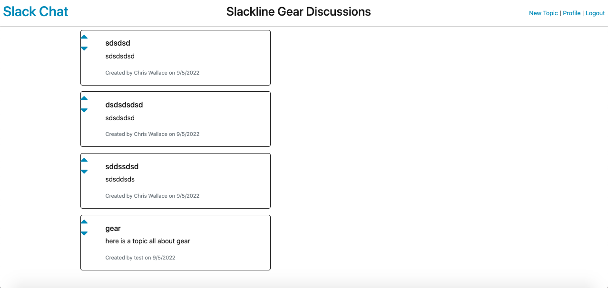
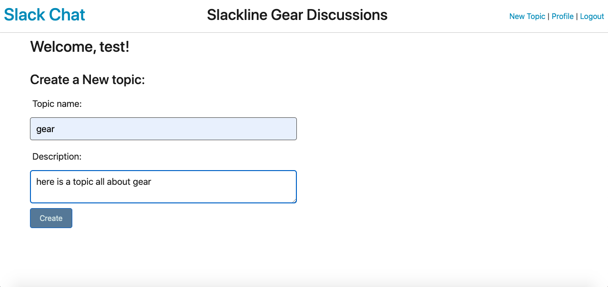
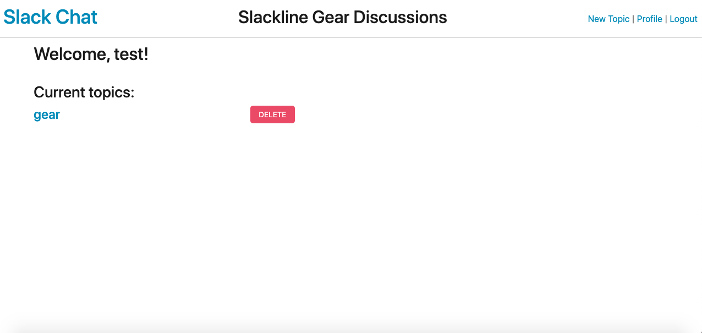
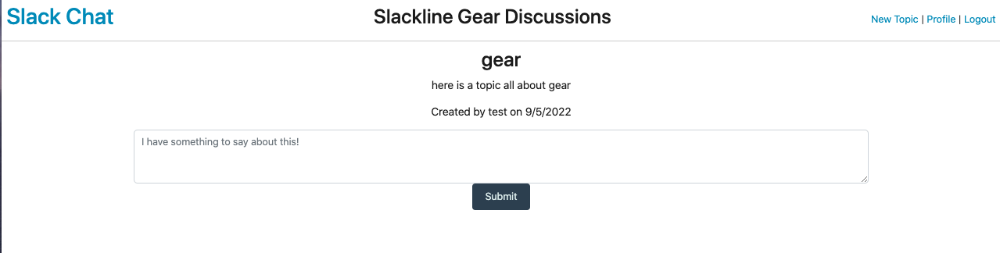

# Blog-Site-Template

## Project Description 
An interactive blog site that allows users to create posts and comment on others posts as well as delete their posts. 
The app in action; https://safe-garden-41274.herokuapp.com/

## Table of Contents
1. [Project Description](#project-description)
1. [Installation Instructions](#install)
1. [Motivation](#motivation)
1. [Contribution guidelines](#contribute)
1. [Test Instructions](#test)
1. [Errors](#errors)
1. [Questions](#questions)

## Installation Instructions: 
No installation nessecary, simply visit https://safe-garden-41274.herokuapp.com/ to use the app.
,

,

,

,

,

## Motivation: 
To share slackline information between people worldwide

## Contribution guidelines: 
Create a fork of this repo to work on expanding the functionality

## Test Instructions: 
By sure to run npm i to install any dependancies. 
Set your mysql password and session secret
the node server.js

## Errors: 
The comments routes are failing to send the topic.id 
Some more work is required to solve this as without the realivent topic id, the comments cannot be added to the realivent database and joined with the topic's by id.

## Questions 
Please email any questions about this project to: Chrisw1096@gmail.com
or contact me though my github: 
[Wollemipines:](https://github.com/Wollemipines)
